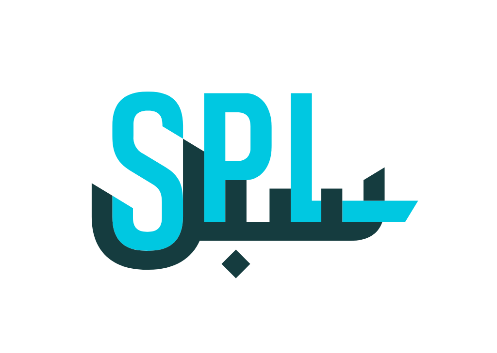
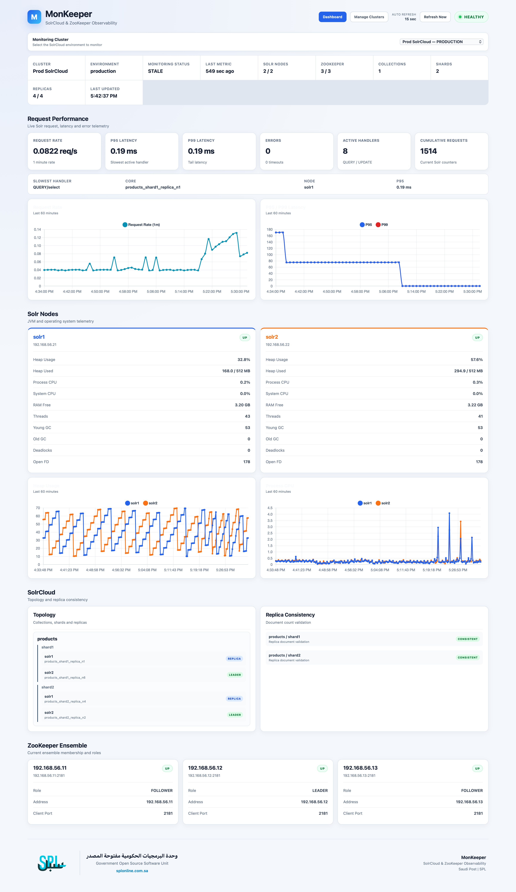

<p align="center">
  
</p>

<h1 align="center">MonKeeper</h1>

<p align="center">
  <strong>SolrCloud & ZooKeeper Monitoring and Observability Platform</strong>
</p>

<p align="center">
  An Open Source Project by <strong>Saudi Post | SPL</strong><br>
  Free and Open Source Software (FOSS) Unit
</p>

---

## About MonKeeper

**MonKeeper** is an open-source monitoring and observability platform developed by **Saudi Post | SPL** through the **Free and Open Source Software (FOSS) Unit**.

MonKeeper provides a centralized operational view of **Apache SolrCloud** and **Apache ZooKeeper** environments through a unified web-based dashboard.

It is designed to help platform, infrastructure, DevOps, and operations teams monitor cluster health, topology, availability, replica consistency, JVM telemetry, and request performance without relying on multiple monitoring interfaces.

MonKeeper automatically discovers the SolrCloud topology through ZooKeeper and provides visibility into Solr nodes, ZooKeeper ensemble members, collections, shards, replicas, leaders, and operational metrics.

---

## Dashboard

<p align="center">
  
</p>

The MonKeeper dashboard provides centralized visibility into:

- SolrCloud cluster health
- Monitoring freshness
- Solr node availability
- ZooKeeper ensemble availability
- Request rate
- P95 and P99 latency
- Request errors
- JVM heap utilization
- CPU utilization
- Garbage collection activity
- Collections and shards
- Replica placement and state
- Shard leaders
- Replica consistency
- ZooKeeper leader and follower roles

---

## Key Capabilities

MonKeeper currently provides:

- SolrCloud cluster discovery
- ZooKeeper ensemble discovery
- Multi-cluster management
- Solr node health monitoring
- ZooKeeper node health monitoring
- Collection and shard discovery
- Replica monitoring
- Shard leader identification
- Replica consistency validation
- JVM and operating system telemetry
- Heap utilization monitoring
- CPU utilization monitoring
- Garbage collection monitoring
- Request rate monitoring
- P95/P99 latency monitoring
- Request error monitoring
- Monitoring freshness indicators
- Historical metrics collection
- Secure Solr credential storage
- Enable and disable monitoring
- Docker-based deployment
- Centralized web dashboard

---

# Quick Start

For an Ubuntu server with Docker and Git installed:

```bash
git clone https://github.com/faizzal/MonKeeper.git
cd MonKeeper
./install.sh
```

Verify the deployment:

```bash
docker compose ps
```

Then open:

```text
http://MONKEEPER_SERVER_IP
```

Example:

```text
http://192.168.56.5
```

Open **Manage Clusters**, add your SolrCloud environment, configure the Solr credentials, and MonKeeper will begin collecting monitoring information.

> For first-time installation, follow the complete installation procedure below.

---

# Architecture

MonKeeper consists of four primary services:

| Component | Technology | Purpose |
|---|---|---|
| Frontend | React / Nginx | Web-based monitoring dashboard |
| API | FastAPI / Python | Configuration and monitoring APIs |
| Collector | Python | SolrCloud and ZooKeeper monitoring engine |
| Database | PostgreSQL | Configuration, topology, credentials, and historical metrics |

## High-Level Architecture

```text
                         Users
                           |
                           | HTTP / HTTPS
                           v
                 +---------------------+
                 |      Frontend       |
                 |    React / Nginx    |
                 +----------+----------+
                            |
                            v
                 +---------------------+
                 |         API         |
                 |       FastAPI       |
                 +----------+----------+
                            |
                +-----------+-----------+
                |                       |
                v                       v
       +----------------+      +----------------+
       |   PostgreSQL   |      |   Collector    |
       +----------------+      +--------+-------+
                                       |
                           +-----------+-----------+
                           |                       |
                           v                       v
                    +-------------+         +-------------+
                    |  SolrCloud  |         | ZooKeeper   |
                    +-------------+         +-------------+
```

## Deployment Flow

```text
GitHub Repository
       |
       v
    git clone
       |
       v
  ./install.sh
       |
       v
 Docker Compose
       |
       +---- PostgreSQL
       |
       +---- FastAPI
       |
       +---- Collector
       |
       +---- Frontend
       |
       v
 MonKeeper Dashboard
       |
       v
 Add SolrCloud Cluster
       |
       v
 Configure Credentials
       |
       v
 Monitoring & Observability
```

---

# System Requirements

## Operating System

MonKeeper is designed to run on Linux.

Ubuntu is recommended.

## Recommended Minimum Resources

For a lab or small environment:

| Resource | Recommended |
|---|---:|
| CPU | 2 vCPU |
| Memory | 4 GB |
| Disk | 20 GB |
| Network | Connectivity to SolrCloud and ZooKeeper |

Production sizing should consider:

- Number of monitored clusters
- Number of Solr nodes
- Number of collections
- Number of shards and replicas
- Metrics collection frequency
- Historical data retention requirements

---

# Software Requirements

The MonKeeper server requires:

- Git
- Docker Engine
- Docker Compose v2
- Network connectivity to SolrCloud
- Network connectivity to ZooKeeper

Verify Docker:

```bash
docker --version
```

Verify Docker Compose:

```bash
docker compose version
```

---

# Network Requirements

The MonKeeper server must be able to communicate with all monitored SolrCloud and ZooKeeper nodes.

## Default Ports

| Component | Port | Protocol | Direction |
|---|---:|---|---|
| MonKeeper Dashboard | 80 | TCP | Client → MonKeeper |
| MonKeeper API | 8000 | TCP | Internal/Admin |
| Apache Solr | 8983 | TCP | MonKeeper → Solr |
| Apache ZooKeeper | 2181 | TCP | MonKeeper → ZooKeeper |
| PostgreSQL | 5432 | TCP | Internal Docker Network |

PostgreSQL should not be exposed externally.

---

# DNS and Hostname Resolution

This is an important deployment requirement.

SolrCloud may advertise its nodes using hostnames such as:

```text
solr1
solr2
```

MonKeeper must be able to resolve the hostnames advertised by SolrCloud.

For example:

```bash
getent hosts solr1
getent hosts solr2
```

If SolrCloud advertises a hostname that cannot be resolved from the MonKeeper environment, ZooKeeper discovery may succeed while Solr topology and metrics collection fail.

For production environments, proper DNS configuration is strongly recommended.

---

# Pre-Installation Connectivity Test

Before installing MonKeeper, verify connectivity from the MonKeeper server to the target environment.

## Test Solr Connectivity

```bash
nc -zv SOLR_NODE_IP 8983
```

Example:

```bash
nc -zv 192.168.56.21 8983
nc -zv 192.168.56.22 8983
```

Expected:

```text
Connection to 192.168.56.21 8983 port [tcp/*] succeeded!
```

## Test ZooKeeper Connectivity

```bash
nc -zv ZOOKEEPER_NODE_IP 2181
```

Example:

```bash
nc -zv 192.168.56.11 2181
nc -zv 192.168.56.12 2181
nc -zv 192.168.56.13 2181
```

All required connections should succeed before continuing.

---

# Installation Guide

## Step 1 — Update Ubuntu

```bash
sudo apt update
```

Optionally install available updates:

```bash
sudo apt upgrade -y
```

---

## Step 2 — Install Required Packages

Install Docker, Docker Compose, Git, and required utilities:

```bash
sudo apt install -y docker.io docker-compose-v2 git openssl
```

---

## Step 3 — Start Docker

Enable Docker at startup and start the service:

```bash
sudo systemctl enable --now docker
```

Verify:

```bash
docker --version
docker compose version
```

Check Docker status:

```bash
systemctl status docker --no-pager
```

Expected:

```text
Active: active (running)
```

---

## Step 4 — Configure Docker User Access

Add the current user to the Docker group:

```bash
sudo usermod -aG docker $USER
```

Log out:

```bash
exit
```

Log back into the server.

Verify:

```bash
docker ps
```

The command should execute without requiring `sudo`.

---

## Step 5 — Clone MonKeeper

Clone the repository:

```bash
git clone https://github.com/faizzal/MonKeeper.git
```

Enter the directory:

```bash
cd MonKeeper
```

Verify:

```bash
git log --oneline -3
```

List the files:

```bash
ls -la
```

The repository should contain:

```text
backend/
collector/
frontend/
postgres/
docker-compose.yml
install.sh
.env.example
.gitignore
```

---

## Step 6 — Run the Installer

Run:

```bash
./install.sh
```

If execute permission is missing:

```bash
chmod +x install.sh
./install.sh
```

The installer prepares the MonKeeper environment and starts the application stack.

The installation process includes:

1. Environment preparation
2. Secret generation
3. PostgreSQL configuration
4. Docker image build
5. Database initialization
6. API startup
7. Collector startup
8. Frontend startup

---

## Step 7 — Verify the Deployment

Run:

```bash
docker compose ps
```

A healthy deployment should show:

```text
monkeeper-api         Up
monkeeper-collector   Up
monkeeper-frontend    Up
monkeeper-postgres    Up (healthy)
```

All four services should remain running.

If a container shows:

```text
Restarting
```

review its logs before continuing.

---

## Step 8 — Verify the API

Run:

```bash
curl -s http://127.0.0.1:8000/clusters | python3 -m json.tool
```

On a fresh installation, the expected response is similar to:

```json
{
    "status": "success",
    "count": 0,
    "clusters": []
}
```

This confirms that:

- PostgreSQL is operational
- The database schema is initialized
- The API is operational
- MonKeeper is ready for configuration

---

## Step 9 — Find the MonKeeper Server IP

Run:

```bash
hostname -I
```

Identify the address reachable from your workstation.

Example:

```text
192.168.56.5
```

---

## Step 10 — Open the Dashboard

Open a browser and navigate to:

```text
http://MONKEEPER_SERVER_IP
```

Example:

```text
http://192.168.56.5
```

The MonKeeper dashboard should now be available.

---

# Configure a SolrCloud Cluster

Open:

```text
Manage Clusters
```

Then select:

```text
+ Add Cluster
```

Complete the cluster configuration.

---

## Cluster Name

Enter a descriptive cluster name.

Example:

```text
Prod SolrCloud
```

---

## Environment

Select the appropriate environment.

Examples:

```text
Production
Staging
Development
Lab
```

---

## ZooKeeper Connection String

Enter the ZooKeeper ensemble connection string.

Format:

```text
HOST1:2181,HOST2:2181,HOST3:2181
```

Example:

```text
192.168.56.11:2181,192.168.56.12:2181,192.168.56.13:2181
```

---

## ZooKeeper Chroot

Enter the ZooKeeper chroot used by SolrCloud.

A common configuration is:

```text
/solr
```

---

## Solr Scheme

Select:

```text
HTTP
```

or:

```text
HTTPS
```

depending on your environment.

---

## Solr Port

The standard Solr port is:

```text
8983
```

---

## Discovery Interval

Example:

```text
60
```

The value is specified in seconds.

Select:

```text
Create Cluster
```

---

# Configure Solr Credentials

If the target SolrCloud environment requires authentication:

1. Open **Manage Clusters**
2. Locate the required cluster
3. Open **Credentials**
4. Enter the Solr username
5. Enter the Solr password
6. Select **Verify & Save**

MonKeeper verifies the supplied credentials against Solr before saving them.

Sensitive Solr credential information is encrypted before being stored in the MonKeeper database.

---

# Verify Solr Authentication Manually

If credential verification fails, test the Solr endpoint directly from the MonKeeper server.

```bash
curl -i -u SOLR_USERNAME \
"http://SOLR_NODE_IP:8983/solr/admin/info/system?wt=json"
```

Example:

```bash
curl -i -u solradmin \
"http://192.168.56.21:8983/solr/admin/info/system?wt=json"
```

Enter the password when prompted.

A successful request should return:

```text
HTTP/1.1 200 OK
```

---

# Verify ZooKeeper

ZooKeeper can be tested using:

```bash
echo stat | nc -w 2 ZOOKEEPER_NODE_IP 2181
```

Example:

```bash
echo stat | nc -w 2 192.168.56.11 2181
```

For a three-node ensemble:

```bash
for ip in 192.168.56.11 192.168.56.12 192.168.56.13; do
  echo "===== $ip ====="
  echo stat | nc -w 2 $ip 2181 | grep -E 'Zookeeper version|Mode|Node count'
  echo
done
```

A healthy three-node ZooKeeper ensemble will normally contain:

```text
1 Leader
2 Followers
```

---

# Verify SolrCloud

Use the Solr Collections API:

```bash
curl -u SOLR_USERNAME \
"http://SOLR_NODE_IP:8983/solr/admin/collections?action=CLUSTERSTATUS&wt=json"
```

Verify:

- `live_nodes` contains the expected Solr nodes
- Collections are visible
- Shards are active
- Replicas are active
- Every shard has a leader
- Collection health is healthy

Example:

```text
Solr Nodes:       2
Collections:      1
Shards:           2
Replicas:         4
Active Replicas:  4
Leaders:          2
```

---

# Verify MonKeeper Discovery

After configuring the cluster and credentials, allow the Collector time to perform discovery and metrics collection.

The dashboard should begin displaying:

```text
Solr Nodes
ZooKeeper Nodes
Collections
Shards
Replicas
Leaders
Request Performance
JVM Metrics
Replica Consistency
```

Example:

```text
Solr Nodes      2 / 2
ZooKeeper       3 / 3
Collections     1
Shards          2
Replicas        4 / 4
```

---

# Verify Cluster Summary API

Run:

```bash
curl -s \
"http://127.0.0.1:8000/solr/summary?cluster_id=1" \
| python3 -m json.tool
```

Example healthy response:

```json
{
    "status": "success",
    "cluster_id": 1,
    "overall_status": "HEALTHY",
    "collections": 1,
    "shards": 2,
    "replicas": 4,
    "active_replicas": 4,
    "leaders": 2,
    "consistent_shards": 2,
    "mismatch_shards": 0,
    "unknown_shards": 0
}
```

---

# Verify Cluster Topology API

Run:

```bash
curl -s \
"http://127.0.0.1:8000/solr/topology?cluster_id=1" \
| python3 -m json.tool
```

The response provides information about:

- Collections
- Shards
- Replicas
- Replica type
- Replica state
- Node placement
- Leader assignment

---

# Monitoring Status

MonKeeper uses monitoring freshness to indicate whether current metrics are being collected.

## FRESH

Recent monitoring information is available.

Example:

```text
Monitoring Status: FRESH
Last Metric: 8 sec ago
```

## STALE

The cluster is enabled but sufficiently recent monitoring information is not available.

Potential causes include:

- Solr connectivity issues
- Authentication failure
- DNS resolution problems
- Collector errors
- Solr node availability issues

## DISABLED

Monitoring has been manually disabled for the cluster.

Existing historical information can remain stored in MonKeeper.

---

# Enable or Disable Monitoring

Open:

```text
Manage Clusters
```

Locate the required cluster.

Use:

```text
Enable
```

to resume monitoring.

Use:

```text
Disable
```

to stop active collection for the cluster.

---

# Operational Commands

## Check Container Status

```bash
docker compose ps
```

## API Logs

```bash
docker compose logs api --tail=100
```

## Collector Logs

```bash
docker compose logs collector --tail=150
```

## Frontend Logs

```bash
docker compose logs frontend --tail=100
```

## PostgreSQL Logs

```bash
docker compose logs postgres --tail=100
```

## Follow Collector Logs

```bash
docker compose logs -f collector
```

## Follow API Logs

```bash
docker compose logs -f api
```

---

# Restart MonKeeper

```bash
docker compose restart
```

Verify:

```bash
docker compose ps
```

---

# Stop MonKeeper

```bash
docker compose down
```

The persistent PostgreSQL data is not normally deleted by this command.

---

# Start MonKeeper

```bash
docker compose up -d
```

Verify:

```bash
docker compose ps
```

---

# Rebuild MonKeeper

After application changes:

```bash
docker compose build
docker compose up -d
```

---

# Updating MonKeeper

Enter the MonKeeper installation directory:

```bash
cd ~/MonKeeper
```

Pull the latest version:

```bash
git pull
```

Rebuild the application:

```bash
docker compose build
```

Apply the updated deployment:

```bash
docker compose up -d
```

Verify:

```bash
docker compose ps
```

Production environments should review release notes and perform appropriate backups before upgrading.

---

# Environment Configuration

MonKeeper uses a local `.env` file for application configuration.

Typical variables include:

```text
POSTGRES_DB
POSTGRES_USER
POSTGRES_PASSWORD
MONKEEPER_SECRET_KEY
```

An example configuration is provided in:

```text
.env.example
```

The real `.env` file must never be committed to source control.

---

# Security

## Protect the Environment File

Restrict access:

```bash
chmod 600 .env
```

Never publish:

- PostgreSQL passwords
- `MONKEEPER_SECRET_KEY`
- Solr passwords
- Private keys
- Production credentials

---

## Credential Encryption

MonKeeper uses the application secret to protect sensitive Solr credential information stored by the application.

The application secret should be:

- Random
- Protected
- Persistent
- Securely backed up when required

Losing or changing the encryption key may prevent existing encrypted credentials from being recovered.

For enterprise production deployments, integration with a centralized secrets-management platform is recommended.

---

# Data Persistence

PostgreSQL data is stored under:

```text
./data/postgres
```

The directory is excluded from Git.

Do not delete this directory unless you intentionally want to remove the MonKeeper database.

---

# Backup Recommendations

For production environments, maintain backups of:

- PostgreSQL database
- MonKeeper configuration
- Application encryption secret

A database backup without the corresponding encryption key may not be sufficient to recover encrypted credentials.

---

# Production Recommendations

For production deployments, consider implementing:

- HTTPS
- Reverse proxy
- Enterprise DNS
- Firewall restrictions
- Administrative access controls
- API access restrictions
- Centralized secrets management
- PostgreSQL backups
- Metrics retention policies
- Centralized logging
- Operating system patching
- Docker security hardening
- Monitoring of the MonKeeper platform itself

A production deployment can follow this model:

```text
                      Users
                        |
                      HTTPS
                        |
                        v
                +---------------+
                | Reverse Proxy |
                +-------+-------+
                        |
                        v
                +---------------+
                |   MonKeeper   |
                |   Frontend    |
                +-------+-------+
                        |
                        v
                +---------------+
                |      API      |
                +-------+-------+
                        |
              +---------+---------+
              |                   |
              v                   v
       +------------+       +-----------+
       | PostgreSQL |       | Collector |
       +------------+       +-----+-----+
                                  |
                          +-------+-------+
                          |               |
                          v               v
                     SolrCloud       ZooKeeper
```

---

# Troubleshooting

## Docker Is Not Running

Check:

```bash
systemctl status docker --no-pager
```

Start Docker:

```bash
sudo systemctl start docker
```

---

## Docker Permission Denied

If:

```bash
docker ps
```

returns a permission error:

```bash
sudo usermod -aG docker $USER
```

Then log out and log back in.

---

## API Is Restarting

Check:

```bash
docker compose logs api --tail=100
```

Then:

```bash
docker compose ps
```

The API should show:

```text
Up
```

instead of:

```text
Restarting
```

---

## PostgreSQL Is Not Healthy

Check:

```bash
docker compose ps postgres
```

Then:

```bash
docker compose logs postgres --tail=100
```

Expected status:

```text
healthy
```

---

## Solr Nodes Are Visible but Metrics Are Empty

Check the following:

1. Solr credentials
2. Solr network connectivity
3. Solr hostname resolution
4. Collector logs
5. API logs

Collector logs:

```bash
docker compose logs collector --tail=150
```

API logs:

```bash
docker compose logs api --tail=100
```

---

## Solr Hostname Cannot Be Resolved

Test:

```bash
getent hosts SOLR_HOSTNAME
```

Example:

```bash
getent hosts solr1
```

If SolrCloud advertises node names that MonKeeper cannot resolve, configure proper DNS or hostname resolution.

---

## Credentials Verification Fails

Test Solr directly:

```bash
curl -i -u SOLR_USERNAME \
"http://SOLR_NODE_IP:8983/solr/admin/info/system?wt=json"
```

Expected:

```text
HTTP/1.1 200 OK
```

If direct authentication succeeds but MonKeeper verification fails:

```bash
docker compose logs api --tail=100
```

---

## ZooKeeper Discovery Fails

Verify connectivity:

```bash
nc -zv ZOOKEEPER_NODE_IP 2181
```

Then:

```bash
echo stat | nc -w 2 ZOOKEEPER_NODE_IP 2181
```

Also verify:

- ZooKeeper connection string
- ZooKeeper chroot
- Firewall rules
- Network connectivity

---

## Check Latest Collected Metrics

Run:

```bash
docker exec monkeeper-postgres \
psql -U monkeeper_app -d monkeeper \
-c "
SELECT
    cluster_id,
    MAX(collected_at) AS last_metric,
    COUNT(*) AS total_rows
FROM solr_metrics
GROUP BY cluster_id;
"
```

This can help determine whether the Collector is actively writing metrics.

---

# Time Synchronization

Accurate time synchronization is important for monitoring and historical telemetry.

Check:

```bash
date
chronyc tracking
```

A healthy Chrony configuration should report:

```text
Leap status : Normal
```

MonKeeper, Solr, and ZooKeeper hosts should use reliable time synchronization.

---

# Project Structure

```text
MonKeeper/
├── backend/
│   ├── Dockerfile
│   ├── main.py
│   └── requirements.txt
│
├── collector/
│   ├── Dockerfile
│   ├── collector.py
│   └── requirements.txt
│
├── frontend/
│   ├── Dockerfile
│   ├── index.html
│   ├── nginx.conf
│   ├── package.json
│   ├── public/
│   │   └── spllogo.png
│   └── src/
│       ├── main.jsx
│       └── styles.css
│
├── postgres/
│   └── init.sql
│
├── docs/
│   └── images/
│       └── dashboard-overview.png
│
├── docker-compose.yml
├── install.sh
├── .env.example
├── .gitignore
└── README.md
```

---

# Technology Stack

| Layer | Technology |
|---|---|
| Frontend | React |
| Web Server | Nginx |
| Backend API | FastAPI |
| Backend Language | Python |
| Monitoring Collector | Python |
| Database | PostgreSQL |
| Deployment | Docker / Docker Compose |
| Search Platform | Apache Solr / SolrCloud |
| Coordination Service | Apache ZooKeeper |

---

# Contributing

Contributions, improvements, bug reports, documentation updates, and technical feedback are welcome in accordance with the project's contribution and governance policies.

A typical contribution workflow is:

```bash
git clone https://github.com/faizzal/MonKeeper.git
cd MonKeeper
git checkout -b feature/my-improvement
```

Make and test the required changes, then commit them:

```bash
git add .
git commit -m "Describe the improvement"
```

Push the branch and create a Pull Request through GitHub.

Do not include credentials, passwords, private keys, production IP addresses, or sensitive organizational information in commits or Pull Requests.

---

# Security Reporting

Do not report sensitive security vulnerabilities by publishing credentials or exploit details in public GitHub issues.

A formal security reporting process should be used once the project's official security contact or `SECURITY.md` process is published.

---

# License

The applicable open-source license for MonKeeper must be defined in the repository's `LICENSE` file.

> Repository visibility alone does not grant unrestricted rights to use, modify, or redistribute the software.

The approved Saudi Post | SPL open-source license should be added before MonKeeper is formally distributed as an open-source project.

---

# Acknowledgements

MonKeeper is built using and integrates with several open-source technologies, including:

- Apache Solr
- Apache ZooKeeper
- PostgreSQL
- FastAPI
- React
- Nginx
- Docker

We acknowledge the communities and contributors behind these technologies.

---

# Developed By

**Saudi Post | SPL**  
**Free and Open Source Software (FOSS) Unit**

MonKeeper is developed as part of Saudi Post | SPL's efforts to support the adoption and development of Free and Open Source Software, reusable engineering capabilities, technical knowledge sharing, and open innovation.

<p align="center">
  
</p>

<p align="center">
  <strong>MonKeeper</strong><br>
  SolrCloud & ZooKeeper Monitoring and Observability Platform<br>
  Saudi Post | SPL
</p>
